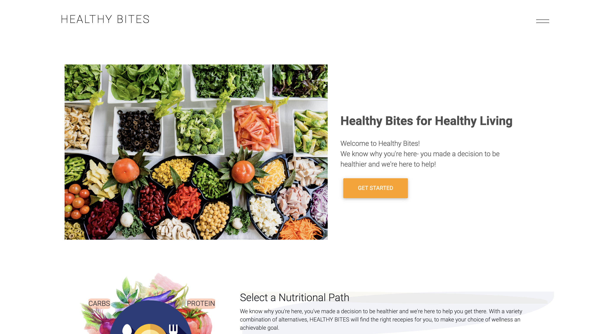

# Healthy Bites

## Description

Healthy Bites is a web application that generates recipes based on culinary and dietary preferences and it also provides a restaurant search based on user input.

## Vision

Future releases of Healthy Bites will include:

- Ability for users to create an account and store their favorite recipes

- Ability for users to pull ingredients from recipes and store in a grocery list

- Healthier options on home page will link to protein, plant, fat or carb based meals respectively

## Interface

## Deployed App

You can find our app [here](https://erodrigueztoimil.github.io/healthy_bites/)
